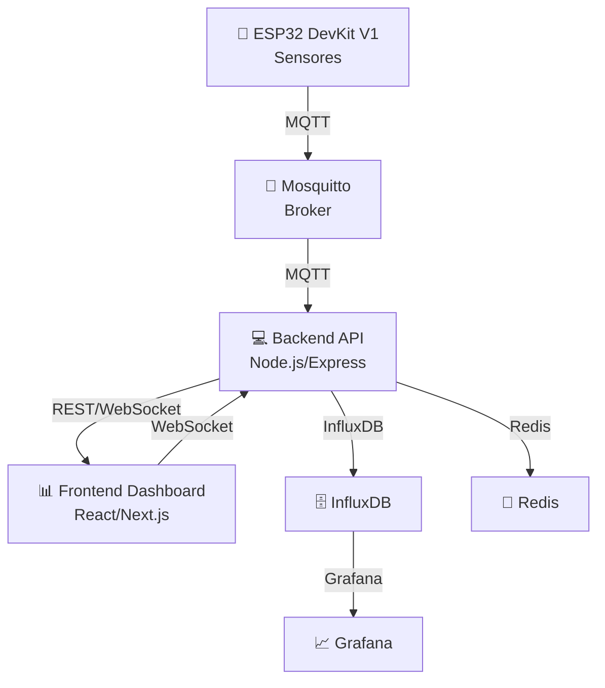

# 🌦️ Estación Meteorológica IoT — Plataforma Integral

Sistema completo y modular para monitoreo meteorológico basado en **Arduino/ESP32**, con dashboard web, almacenamiento en base de datos de series temporales y arquitectura escalable.

---

## 🚀 ¿Qué Ofrece Este Proyecto?

- **8 Sensores Ambientales**: Temperatura, humedad, presión, luz, lluvia, CO, calidad del aire, PM2.5.
- **Hardware**: ESP32 DevKit V1 con configuración WiFi dinámica (WiFiManager).
- **Conectividad**: WiFi 802.11n + MQTT (con WebSocket).
- **Base de Datos**: InfluxDB 2.7 (series temporales, retención automática).
- **Dashboard**: React 19/Next.js 15 + TypeScript 5.9 + Material-UI 7.3.1.
- **Visualización**: Grafana, mapas Leaflet, gráficos Chart.js 4.5.
- **API REST**: Backend Node.js/Express 4.18, seguro y documentado.
- **Autenticación**: JWT + bcryptjs (listo para activar).
- **Cache**: Redis 7 para alto rendimiento.
- **WebSockets**: Socket.IO 4.8 para datos en tiempo real.
- **Testing**: Jest para backend y frontend.
- **Documentación**: Swagger/OpenAPI automática.
- **Monitoreo**: Logging estructurado con Winston + health checks.

---

## 🏗️ Arquitectura Visual del Sistema



---

## ✨ Características Clave

- **Lectura y transmisión de datos cada 60s** ⏱️
- **Configuración WiFi fácil** (portal cautivo)
- **MQTT seguro y eficiente** 🔗
- **API REST robusta y documentada** 📚
- **Dashboard interactivo y responsivo** 📊
- **Alertas inteligentes y personalizables** 🚨
- **Visualización avanzada con mapas y gráficos** 🗺️📈
- **Monitoreo y logging estructurado** 📝
- **Testing automatizado** 🧪
- **Despliegue orquestado con Docker Compose** 🐳

---

## 🛠️ Stack Tecnológico

- **Firmware**: ESP32 DevKit V1, Arduino Framework, WiFiManager, PubSubClient, Deep Sleep.
- **Backend**: Node.js 18+, Express 4.18, MQTT.js, InfluxDB Client, Winston, Redis, Socket.IO, JWT, Joi, Swagger.
- **Frontend**: React 19, Next.js 15, TypeScript 5.9, Material-UI 7.3.1, Chart.js, Leaflet, Socket.IO Client, Day.js.
- **Infraestructura**: InfluxDB 2.7, Redis 7, Mosquitto MQTT, Grafana, Docker Compose.
- **Testing**: Jest, React Testing Library, Supertest.

---

## 🧩 Diagrama de Flujo de Datos

1. **Captura de datos**: ESP32 lee sensores y envía JSON vía MQTT.
2. **Transmisión**: MQTT Broker (Mosquitto) recibe y distribuye mensajes.
3. **Procesamiento**: Backend valida, almacena en InfluxDB y genera alertas.
4. **Visualización**: Frontend consume API/WebSocket y muestra datos en tiempo real.
5. **Monitoreo**: Grafana y health checks para observabilidad.

---

## ⚡ Inicio Rápido

### 1️⃣ Infraestructura

```bash
git clone <repository-url>
cd estacion-metereologica
docker-compose up -d
docker-compose ps
```
- **InfluxDB**: http://localhost:8086
- **Grafana**: http://localhost:3000 (admin/grafana123)
- **MQTT Broker**: localhost:1883

### 2️⃣ Backend

```bash
cd backend
npm install
cp .env.example .env
npm run dev
curl http://localhost:5002/health
```

### 3️⃣ Frontend

```bash
cd frontend
npm install
cp .env.example .env.local
npm run dev
```
- Accede a: http://localhost:3001

### 4️⃣ ESP32

- Sube el firmware desde `arduino/weather_station_esp32/weather_station_esp32.ino`
- Conecta al AP "WeatherStation-Setup" para configurar WiFi/MQTT
- Revisa el monitor serie para diagnóstico

---

## 📡 MQTT — Estructura de Comunicación

- **Publicación de datos**: `weather/data/{station_id}` (JSON)
- **Estado del sistema**: `weather/status/{station_id}`
- **Comandos remotos**: `weather/command/{station_id}`

**Ejemplo de payload:**
```json
{
  "station_id": "ESP32_STATION_001",
  "timestamp": 1234567890,
  "temperature": 25.67,
  "humidity": 65.23,
  "pressure": 1013.25,
  "light_level": 1234.56,
  "rainfall": 0.2,
  "co_level": 2.45,
  "air_quality_digital": 0,
  "dust_pm25": 12.34,
  "uptime": 12345,
  "signal_strength": -45,
  "free_heap": 25600
}
```

---

## 🖥️ Dashboard y Visualización

- **Frontend**: http://localhost:3001
- **Grafana**: http://localhost:3000 (Dashboards preconfigurados)
- **InfluxDB**: http://localhost:8086 (admin/weather123)

---

## 🧪 Testing y Calidad

- **Backend**: `npm test` (Jest)
- **Frontend**: `npm test` (Jest + React Testing Library)
- **Cobertura**: `npm run test:coverage`

---

## 🛠️ Personalización y Expansión

- **Agregar sensores**: Añadir en firmware, backend y frontend.
- **Alertas**: Editar reglas en `backend/src/services/alertService.js`.
- **Visualización**: Crear nuevos paneles en Grafana o componentes en React.

---

## 📦 Estructura del Proyecto

```plaintext
estacion-metereologica/
├── arduino/
├── backend/
├── frontend/
├── docker/
├── docker-compose.yml
├── CLAUDE.md
└── README.md
```

---

## 🆘 Solución de Problemas

- **Frontend "Failed to fetch"**: Verifica `.env.local` y backend activo.
- **Puertos ocupados**: Next.js autoasigna, Grafana usa 3000.
- **Sin datos en dashboard**: Verifica servicios Docker, logs backend, conexión MQTT.
- **ESP32 sin WiFi**: Resetear WiFiManager, revisar AP y configuración MQTT.

---

## 🤝 Contribuir

1. 🍴 Fork del repo
2. 🌟 Crea tu rama feature
3. 📝 Commit y push
4. 🧪 Ejecuta tests
5. 🔄 Abre Pull Request

---

## 📄 Licencia

MIT License — ver archivo [LICENSE](LICENSE).

---

## 📊 Estado del Sistema

- **Backend**: Node.js/Express 4.18.2, JWT, Winston
- **Frontend**: React 19/Next.js 15.4, TypeScript 5.9, Material-UI 7.3.1
- **Base de Datos**: InfluxDB 2.7, Redis 7
- **Hardware**: ESP32 DevKit V1 + 8 sensores
- **Infraestructura**: Docker Compose, health checks

---

**⚡ Plataforma IoT Meteorológica — Inteligente, Modular y Escalable ⚡**