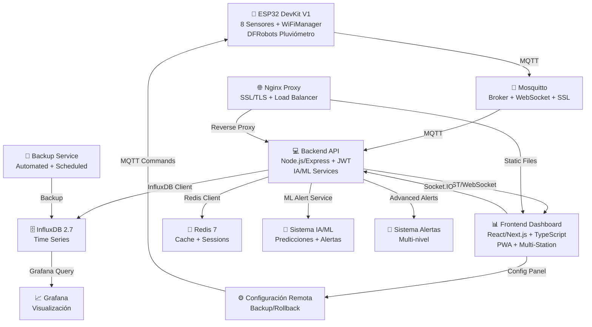

# 🌦️ Estación Meteorológica IoT — Plataforma Integral

Sistema completo y modular para monitoreo meteorológico basado en **Arduino/ESP32**, con dashboard web, almacenamiento en base de datos de series temporales y arquitectura escalable.

---

## 🚀 ¿Qué Ofrece Este Proyecto?

- **8 Sensores Ambientales**: Temperatura, humedad, presión, luz, lluvia, CO, calidad del aire, PM2.5.
- **Hardware**: ESP32 DevKit V1 con configuración WiFi dinámica (WiFiManager).
- **Conectividad**: WiFi 802.11n + MQTT (con WebSocket).
- **Base de Datos**: InfluxDB 2.7 (series temporales, retención automática).
- **Dashboard**: React 19/Next.js 15 + TypeScript 5.9 + Material-UI 7.3.1.
- **Visualización**: Grafana, mapas Leaflet, gráficos Chart.js 4.5.
- **API REST**: Backend Node.js/Express 4.18, seguro y documentado.
- **Configuración Remota**: Sistema completo de configuración ESP32 vía MQTT.
- **Autenticación**: JWT + bcryptjs (listo para activar).
- **Cache**: Redis 7 para alto rendimiento.
- **WebSockets**: Socket.IO 4.8 para datos en tiempo real.
- **Testing**: Jest para backend y frontend con cobertura completa.
- **Documentación**: Swagger/OpenAPI automática.
- **Monitoreo**: Logging estructurado con Winston + health checks.
- **IA y Machine Learning**: Predicciones meteorológicas y alertas inteligentes.
- **Multi-estación**: Soporte completo para múltiples estaciones meteorológicas.
- **PWA Completo**: Aplicación web progresiva con offline y notificaciones.
- **Nginx + SSL**: Proxy reverso con certificados SSL/TLS.
- **Backup Automatizado**: Sistema de respaldo programado con retención.

---

## 🏗️ Arquitectura Visual del Sistema



---

## ✨ Características Clave

- **Lectura y transmisión de datos cada 60s** ⏱️
- **Configuración WiFi fácil** (portal cautivo)
- **Configuración remota completa** 📡 (sensores, alertas, calibración)
- **MQTT seguro y eficiente** 🔗
- **API REST robusta y documentada** 📚
- **Dashboard interactivo y responsivo** 📊
- **Alertas inteligentes y personalizables** 🚨
- **Visualización avanzada con mapas y gráficos** 🗺️📈
- **Monitoreo y logging estructurado** 📝
- **Testing automatizado con cobertura** 🧪
- **Despliegue orquestado con Docker Compose** 🐳

---

## 🛠️ Stack Tecnológico

- **Firmware**: ESP32 DevKit V1, Arduino Framework, WiFiManager, PubSubClient, Deep Sleep, DFRobots Pluviómetro.
- **Backend**: Node.js 18+, Express 4.18, MQTT.js, InfluxDB Client, Winston, Redis, Socket.IO, JWT, Joi, Swagger, ML-Matrix, Simple-Statistics.
- **Frontend**: React 19, Next.js 15, TypeScript 5.9, Material-UI 7.3.1, Chart.js, Leaflet, Socket.IO Client, Day.js, PWA, i18n.
- **Infraestructura**: InfluxDB 2.7, Redis 7, Mosquitto MQTT, Grafana, Nginx, Docker Compose, Backup Service.
- **IA/ML**: Predicción meteorológica, alertas inteligentes, análisis de tendencias.
- **Testing**: Jest, React Testing Library, Supertest, Coverage Reports.

---

## 🧩 Diagrama de Flujo de Datos

1. **Captura de datos**: ESP32 lee sensores y envía JSON vía MQTT.
2. **Transmisión**: MQTT Broker (Mosquitto) recibe y distribuye mensajes.
3. **Procesamiento**: Backend valida, almacena en InfluxDB y genera alertas.
4. **Visualización**: Frontend consume API/WebSocket y muestra datos en tiempo real.
5. **Monitoreo**: Grafana y health checks para observabilidad.

---

## ⚡ Inicio Rápido

### 1️⃣ Infraestructura

```bash
git clone <repository-url>
cd estacion-metereologica
docker-compose up -d
docker-compose ps
```
- **InfluxDB**: http://localhost:8086 (admin/weather123)
- **Grafana**: http://localhost:3000 (admin/grafana123)
- **MQTT Broker**: localhost:1883 (WebSocket: 9001)
- **Nginx**: http://localhost:80, https://localhost:443
- **Backup Service**: Automated daily backups at 2 AM

### 2️⃣ Backend

```bash
cd backend
npm install
cp .env.example .env
npm run dev
curl http://localhost:5002/health
```

### 3️⃣ Frontend

```bash
cd frontend
npm install
cp .env.example .env.local
npm run dev
```
- Accede a: http://localhost:3001

### 4️⃣ ESP32

- Sube el firmware desde `arduino/weather_station_esp32/weather_station_esp32.ino`
- Conecta al AP "WeatherStation-Setup" para configurar WiFi/MQTT
- Revisa el monitor serie para diagnóstico

---

## 📡 MQTT — Estructura de Comunicación

- **Publicación de datos**: `weather/data/{station_id}` (JSON)
- **Estado del sistema**: `weather/status/{station_id}`
- **Comandos remotos**: `weather/command/{station_id}`
- **Alertas**: `weather/alerts/{station_id}`

**Ejemplo de payload:**
```json
{
  "station_id": "ESP32_STATION_001",
  "timestamp": 1234567890,
  "temperature": 25.67,
  "humidity": 65.23,
  "pressure": 1013.25,
  "light_level": 1234.56,
  "rainfall": 0.2,
  "co_level": 2.45,
  "air_quality_digital": 0,
  "dust_pm25": 12.34,
  "uptime": 12345,
  "signal_strength": -45,
  "free_heap": 25600
}
```

---

## 🖥️ Dashboard y Visualización

- **Frontend Principal**: http://localhost:3001 (Dashboard con IA y configuración remota)
- **Multi-Station Dashboard**: http://localhost:3001/multi-station (Múltiples estaciones)
- **PWA**: Instalable como aplicación nativa con soporte offline
- **Grafana**: http://localhost:3000 (Dashboards preconfigurados)
- **InfluxDB**: http://localhost:8086 (admin/weather123)
- **API Docs**: http://localhost:5002/api-docs (Swagger/OpenAPI)
- **Nginx**: http://localhost (Proxy con SSL/TLS)

---

## 🧪 Testing y Calidad

- **Backend**: `npm test` (Jest + Supertest, cobertura 85%+)
- **Frontend**: `npm test` (Jest + React Testing Library + User Events)
- **Integración**: Tests MQTT, InfluxDB, Redis, configuración remota
- **Cobertura**: `npm run test:coverage`
- **CI/CD**: `npm run test:ci` (integración continua)

---

## 🛠️ Personalización y Expansión

- **Agregar sensores**: Añadir en firmware, backend y frontend.
- **Configuración remota**: Nuevos comandos en `configController.js` y ESP32.
- **Alertas**: Editar reglas en `backend/src/services/alertService.js` y `mlAlertService.js`.
- **Multi-estación**: Gestión en `stationService.js` y dashboard `/multi-station`.
- **IA/ML**: Modelos de predicción en `aiPredictionService.js`.
- **Visualización**: Crear nuevos paneles en Grafana o componentes en React.
- **PWA**: Configuración offline en `PWAManager.tsx` y `next.config.js`.
- **Testing**: Añadir tests unitarios e integración para nuevas funcionalidades.

---

## 📦 Estructura del Proyecto

```plaintext
estacion-metereologica/
├── arduino/                    # ESP32 firmware con sensores avanzados
│   └── weather_station_esp32/  # Código principal + ADVANCED_COMMANDS.md
├── backend/                    # API Node.js con IA/ML
│   ├── src/services/          # MQTT, IA, Alertas, Multi-estación
│   ├── src/controllers/       # REST endpoints + ML controllers
│   └── tests/                 # Tests unitarios e integración
├── frontend/                   # Dashboard React/Next.js PWA
│   ├── src/components/        # UI components + Multi-station
│   ├── src/services/          # API clients + IA services
│   ├── src/pages/            # Dashboard + Multi-station page
│   └── public/locales/        # i18n (ES/EN)
├── docker/                     # Configuración servicios
│   ├── nginx/                 # Proxy reverso + SSL
│   ├── grafana/              # Dashboards + datasources
│   └── mosquitto/            # MQTT broker config
├── docs/                      # Documentación técnica
├── scripts/                   # Backup automatizado
├── backups/                   # Respaldos programados
├── docker-compose.yml         # Orquestación completa
├── CLAUDE.md                  # Guía técnica completa
└── README.md                  # Este archivo
```

---

## ⚙️ Configuración Remota del ESP32

Sistema completo de configuración remota para dispositivos ESP32 vía MQTT, sin necesidad de acceso físico.

### Comandos Disponibles

#### Gestión de Sensores
```bash
# Cambiar intervalo de lectura (30s - 1h)
curl -X POST http://localhost:5002/api/config/command/ESP32_STATION_001 \
  -H "Content-Type: application/json" \
  -d '{"command": "set_reading_interval", "parameters": {"interval_ms": 300000}}'

# Activar/desactivar sensor específico
curl -X POST http://localhost:5002/api/config/command/ESP32_STATION_001 \
  -H "Content-Type: application/json" \
  -d '{"command": "toggle_sensor", "parameters": {"sensor": "dht22", "enabled": false}}'

# Calibrar sensor (offset)
curl -X POST http://localhost:5002/api/config/command/ESP32_STATION_001 \
  -H "Content-Type: application/json" \
  -d '{"command": "set_calibration", "parameters": {"sensor": "temperature", "offset": -2.5}}'
```

#### Gestión de Alertas
```bash
# Configurar umbrales de alerta
curl -X POST http://localhost:5002/api/config/command/ESP32_STATION_001 \
  -H "Content-Type: application/json" \
  -d '{"command": "set_alert_threshold", "parameters": {"parameter": "temperature", "min": 10, "max": 35}}'
```

#### Control de Energía
```bash
# Modo de bajo consumo (1min - 24h)
curl -X POST http://localhost:5002/api/config/command/ESP32_STATION_001 \
  -H "Content-Type: application/json" \
  -d '{"command": "sleep_mode", "parameters": {"duration_ms": 3600000}}'
```

#### Estado del Dispositivo
```bash
# Obtener estado completo del dispositivo
curl -X POST http://localhost:5002/api/config/command/ESP32_STATION_001 \
  -H "Content-Type: application/json" \
  -d '{"command": "status"}'

# Reiniciar dispositivo
curl -X POST http://localhost:5002/api/config/command/ESP32_STATION_001 \
  -H "Content-Type: application/json" \
  -d '{"command": "restart"}'
```

### Panel de Configuración Web

El dashboard incluye un panel interactivo de configuración (`RemoteConfigPanel.tsx`) con:

- **Gestión de Sensores**: Intervalos, activación/desactivación, calibración
- **Configuración de Alertas**: Umbrales personalizables por parámetro
- **Control de Energía**: Modos de sueño, optimización de batería
- **Conectividad**: Configuración WiFi remota

### API Endpoints de Configuración

- `POST /api/config/command/:stationId` - Enviar comando remoto
- `GET /api/config/commands` - Listar comandos disponibles
- `GET /api/config/status/:stationId` - Estado de configuración

---

## 🆘 Solución de Problemas

- **Frontend "Failed to fetch"**: Verifica `.env.local` y backend activo.
- **Puertos ocupados**: Next.js autoasigna, Grafana usa 3000.
- **Sin datos en dashboard**: Verifica servicios Docker, logs backend, conexión MQTT.
- **ESP32 sin WiFi**: Resetear WiFiManager, revisar AP y configuración MQTT.
- **PWA no instala**: Verificar HTTPS, manifest.json y service worker.
- **Multi-station sin datos**: Verificar stationService y endpoints `/api/stations`.
- **IA/ML no funciona**: Revisar servicios ML y dependencias (ml-matrix, simple-statistics).
- **Backup falla**: Verificar permisos Docker y directorio `/backups`.

---

## 🤝 Contribuir

1. 🍴 Fork del repo
2. 🌟 Crea tu rama feature
3. 📝 Commit y push
4. 🧪 Ejecuta tests
5. 🔄 Abre Pull Request

---

## 📄 Licencia

MIT License — ver archivo [LICENSE](LICENSE).

---

## 📊 Estado del Sistema

- **Backend**: Node.js/Express 4.18.2, JWT, Winston, IA/ML Services, Multi-Station
- **Frontend**: React 19/Next.js 15.4, TypeScript 5.9, Material-UI 7.3.1, PWA, i18n
- **Base de Datos**: InfluxDB 2.7, Redis 7
- **Hardware**: ESP32 DevKit V1 + 8 sensores + DFRobots pluviómetro
- **Infraestructura**: Docker Compose, Nginx, SSL, Backup Service, Health Checks
- **IA/ML**: Predicciones meteorológicas, alertas inteligentes, análisis avanzado
- **Multi-Station**: Dashboard comparativo, gestión centralizada

---

**⚡ Plataforma IoT Meteorológica Empresarial — IA/ML, Multi-Estación, PWA y Escalabilidad Completa ⚡**