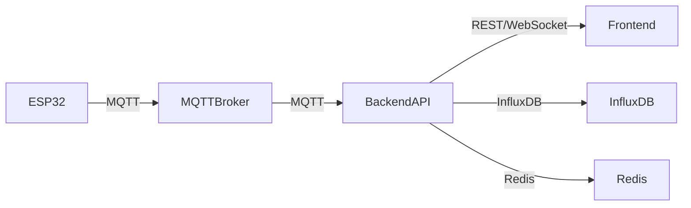

# 🌦️ Weather Station Backend API

## 📖 Descripción General

API backend **robusta y moderna** para el sistema de estación meteorológica IoT. Construida con **Node.js/Express**, integra MQTT para comunicación con dispositivos ESP32, InfluxDB para almacenamiento de series temporales y expone endpoints REST documentados, autenticados y monitoreados en tiempo real.

---

## ✨ Características Destacadas

- 🚀 **API REST** con Express.js 4.18.2
- 📡 **Integración MQTT** para datos en tiempo real
- 📊 **InfluxDB** para almacenamiento eficiente de series temporales
- 🔐 **Autenticación JWT** y gestión de usuarios
- ⚡ **Cache Redis** para alto rendimiento
- 🌐 **WebSocket** (Socket.IO) para actualizaciones instantáneas
- 📚 **Documentación Swagger/OpenAPI** autogenerada
- 🛡️ **Middleware de seguridad** (Helmet, CORS, Rate Limiting)
- 📝 **Logging avanzado** con Winston
- 🚨 **Alertas inteligentes** con umbrales configurables
- 🔍 **Monitoreo y métricas de salud**
- 🧪 **Testing automatizado** (Jest, Supertest)

---

## 🛠️ Tecnologías y Dependencias

### Principales
- **Express.js** – Framework web
- **MQTT** – Comunicación IoT
- **InfluxDB Client** – Base de datos de series temporales
- **Socket.IO** – WebSocket en tiempo real
- **Redis** – Cache y sesiones
- **Winston** – Logging
- **Joi** – Validación de datos

### Seguridad
- **Helmet** – Headers de seguridad
- **bcryptjs** – Hash de contraseñas
- **jsonwebtoken** – Tokens JWT
- **rate-limiter-flexible** – Limitación de requests

### Documentación y Testing
- **Swagger-jsdoc** y **swagger-ui-express**
- **Jest** y **Supertest**

---

## 🚀 Instalación Rápida

### 1️⃣ Requisitos Previos
- Node.js 16+ y npm
- Docker y Docker Compose
- Git

### 2️⃣ Instalación
```bash
# Clona el repositorio
git clone <repo-url>
cd backend

# Instala dependencias
npm install

# Copia y edita variables de entorno
cp .env.example .env
```

### 3️⃣ Configuración de Entorno
```env
# Server Configuration
PORT=5002
NODE_ENV=development

# InfluxDB Configuration
INFLUXDB_URL=http://localhost:8086
INFLUXDB_TOKEN=weather-station-token-12345
INFLUXDB_ORG=weather-station
INFLUXDB_BUCKET=weather-data

# MQTT Configuration
MQTT_BROKER_URL=mqtt://localhost:1883
MQTT_CLIENT_ID=weather-backend

# Redis Configuration
REDIS_URL=redis://localhost:6379

# JWT Configuration
JWT_SECRET=your-secret-key-here
JWT_EXPIRES_IN=24h

# Rate Limiting
RATE_LIMIT_WINDOW_MS=900000
RATE_LIMIT_MAX_REQUESTS=100

# Logging
LOG_LEVEL=info
LOG_FILE_ENABLED=true
```

### 4️⃣ Levanta los servicios con Docker
```bash
# Desde el directorio raíz del proyecto
docker-compose up -d

# Verifica que todos los servicios estén corriendo
docker ps

# Verifica logs si es necesario
docker-compose logs -f
```

### 5️⃣ Inicia el Backend
```bash
# Modo desarrollo con auto-reload
npm run dev

# Modo producción
npm start
```

---

## 🏃‍♂️ Comandos Útiles

### Desarrollo
- 🛠️ **Modo desarrollo:** `npm run dev`
- 🚀 **Modo producción:** `npm start`

### Testing
- 🧪 **Tests unitarios:** `npm test`
- 👀 **Cobertura:** `npm run test:coverage`
- 🔄 **Tests CI/CD:** `npm run test:ci`
- 🎯 **Tests específicos:** `npm test -- --testPathPattern=configController`

### Monitoreo
- 🏥 **Health check:** `curl http://localhost:5002/health`
- 📊 **Última lectura:** `curl http://localhost:5002/api/weather/data/ESP32_STATION_001/latest`
- 📈 **Estado servicios:** `docker ps`

---

## 🏗️ Arquitectura Visual



- **ESP32**: Dispositivos sensores
- **MQTT Broker**: Puente de mensajes
- **Backend API**: Procesamiento, reglas, almacenamiento
- **InfluxDB**: Datos históricos
- **Redis**: Cache y sesiones
- **Frontend**: Visualización y monitoreo

---

## 🛣️ Endpoints Principales

### 🌡️ Weather Data
- `GET /api/weather/data/:stationId/latest` – Última lectura
- `GET /api/weather/data/:stationId?timeRange=30m` – Históricos
- `GET /api/weather/data/:stationId/summary` – Estadísticas
- `GET /api/weather/stations` – Listado de estaciones
- `POST /api/weather/data` – Recibir datos
- `GET /api/weather/export/:stationId` – Exportar CSV/JSON

### 🚨 Alerts
- `GET /api/alerts/:stationId` – Alertas por estación
- `POST /api/alerts` – Nueva alerta
- `PUT /api/alerts/:alertId/acknowledge` – Reconocer alerta

### 🔐 Auth
- `POST /api/auth/login` – Login
- `POST /api/auth/register` – Registro
- `POST /api/auth/refresh` – Renovar token

### ⚙️ Remote Configuration
- `POST /api/config/command/:stationId` – Enviar comando remoto
- `GET /api/config/commands` – Lista comandos disponibles
- `GET /api/config/status/:stationId` – Estado configuración estación

### 📊 Monitoring
- `GET /api/monitoring/health` – Estado del sistema
- `GET /api/monitoring/metrics` – Métricas

### 🏥 Health Check
- `GET /health` – Verificación completa

---

## 📚 Documentación Interactiva

- 🌐 **Swagger UI:** [http://localhost:5002/api-docs](http://localhost:5002/api-docs)
- 📄 **Spec JSON:** [http://localhost:5002/api-docs.json](http://localhost:5002/api-docs.json)

> Documentación generada automáticamente desde comentarios JSDoc.

---

## ⚙️ Sistema de Configuración Remota

El sistema permite control completo de las estaciones ESP32 desde el dashboard web sin acceso físico.

### Comandos Disponibles

#### 🔧 Comandos Básicos
```bash
# Estado del dispositivo
curl -X POST http://localhost:5002/api/config/command/ESP32_STATION_001 \
  -H "Content-Type: application/json" \
  -d '{"command": "status"}'

# Reiniciar dispositivo
curl -X POST http://localhost:5002/api/config/command/ESP32_STATION_001 \
  -H "Content-Type: application/json" \
  -d '{"command": "restart"}'
```

#### 📊 Configuración de Sensores
```bash
# Cambiar intervalo de lectura (30s - 1h)
curl -X POST http://localhost:5002/api/config/command/ESP32_STATION_001 \
  -H "Content-Type: application/json" \
  -d '{"command": "set_reading_interval", "parameters": {"interval_ms": 300000}}'

# Activar/desactivar sensor específico
curl -X POST http://localhost:5002/api/config/command/ESP32_STATION_001 \
  -H "Content-Type: application/json" \
  -d '{"command": "toggle_sensor", "parameters": {"sensor": "dht22", "enabled": false}}'

# Calibración de sensores
curl -X POST http://localhost:5002/api/config/command/ESP32_STATION_001 \
  -H "Content-Type: application/json" \
  -d '{"command": "set_calibration", "parameters": {"sensor": "temperature", "offset": -2.5}}'
```

#### 🚨 Configuración de Alertas
```bash
# Configurar umbrales de alerta
curl -X POST http://localhost:5002/api/config/command/ESP32_STATION_001 \
  -H "Content-Type: application/json" \
  -d '{"command": "set_alert_threshold", "parameters": {"parameter": "temperature", "min": 10, "max": 35}}'
```

#### ⚡ Gestión de Energía
```bash
# Modo sleep para ahorro energético
curl -X POST http://localhost:5002/api/config/command/ESP32_STATION_001 \
  -H "Content-Type: application/json" \
  -d '{"command": "sleep_mode", "parameters": {"duration_ms": 3600000}}'
```

### Sensores Soportados
- `dht22` - Temperatura/humedad
- `bmp085` - Presión barométrica
- `rain` - Detección de lluvia
- `mq7` - Monóxido de carbono
- `mq135` - Calidad del aire
- `dsm501a` - Partículas PM2.5
- `bh1750` - Intensidad luminosa

---

## 🚨 Sistema de Alertas Inteligente

- 🔔 **Reglas configurables** por parámetro y severidad
- 🟢 LOW | 🟡 MEDIUM | 🔴 HIGH | 🚨 CRITICAL
- 💬 Notificaciones en tiempo real vía WebSocket

---

## 🗄️ Esquema de Base de Datos

- **InfluxDB**: 
  - Medición: `weather`
  - Tags: `station_id`
  - Campos: `temperature`, `humidity`, `pressure`, etc.
- **Alertas**:
  - Medición: `alerts`
  - Tags: `station_id`, `severity`
  - Campos: `parameter`, `value`, `threshold`, `message`, `acknowledged`

---

## 🧪 Testing y Calidad

### Infraestructura de Testing
- **Jest** 29.6.2 con configuración completa
- **Supertest** 6.3.3 para testing de endpoints
- **Estructura modular** en directorios `/tests/services/` y `/tests/integration/`
- **Cobertura detallada** con múltiples formatos de salida
- **CI/CD ready** con scripts optimizados

### Comandos de Testing
```bash
# Tests unitarios
npm test

# Tests con cobertura
npm run test:coverage

# Tests para CI/CD
npm run test:ci

# Tests específicos
npm test tests/controllers/configController.test.js
npm test tests/integration/mqttCommands.test.js
```

### Cobertura de Testing
- ✅ Tests unitarios para controladores y servicios
- ✅ Tests de integración MQTT
- ✅ Tests de configuración remota
- ✅ Tests de endpoints con autenticación
- ✅ Mocks de dependencias externas (MQTT, InfluxDB, Redis)

---

## 🔍 Monitoreo y Observabilidad

- **Health Check**: Estado general y dependencias
- **Métricas**: Uptime, memoria, conexiones, latencia, errores
- **Logs**: Winston multi-transporte (archivo y consola)

---

## 🔄 Integración MQTT

- **Entrada**: `weather/data/{stationId}`
- **Estado**: `weather/status/{stationId}`
- **Comandos**: `weather/command/{stationId}`
- **Alertas**: `weather/alerts/{stationId}`

---

## 🌐 WebSocket Events

- `weather_update` – Nueva lectura
- `alert_created` – Nueva alerta
- `station_status` – Estado de estación
- `system_health` – Salud del sistema

---

## 🚀 Despliegue Seguro

### Variables de Entorno Críticas
- `NODE_ENV=production` - Modo producción
- `JWT_SECRET` - Clave secreta para tokens
- `INFLUXDB_TOKEN` - Token de acceso InfluxDB
- `PORT=5002` - Puerto del servidor (configurado y unificado)

### Configuración de Producción
- **HTTPS recomendado** con certificados SSL/TLS
- **Firewall y backup** activos
- **Logging optimizado** (`LOG_LEVEL=warn`)
- **Rate limiting** configurado para prevenir abuso
- **Helmet** para headers de seguridad
- **CORS** configurado para dominios específicos

### Sistema Listo para Producción
- ✅ **Autenticación JWT** implementada y configurable
- ✅ **Redis cache** disponible con configuración cliente
- ✅ **WebSocket (Socket.IO)** implementado y listo
- ✅ **Middleware de seguridad** completo
- ✅ **Health checks** de Docker para todos los servicios
- ✅ **Logging Winston** con rotación de archivos
- ✅ **Documentación Swagger** autogenerada

---

## 🐛 Solución de Problemas

### Problemas Comunes

#### MQTT No Conecta
```bash
# Verificar broker MQTT
docker exec weather_mosquitto mosquitto_sub -h localhost -t "weather/data/+" -v

# Verificar logs del servicio MQTT
docker-compose logs mosquitto
```

#### InfluxDB Sin Datos
```bash
# Verificar servicio InfluxDB
curl http://localhost:8086/health

# Limpiar datos si necesario
docker exec weather_influxdb influx delete \
  --bucket weather-data \
  --start 1970-01-01T00:00:00Z \
  --stop 2025-12-31T23:59:59Z \
  --org weather-station \
  --token weather-station-token-12345
```

#### API No Responde
```bash
# Verificar salud del backend
curl http://localhost:5002/health

# Verificar última data
curl http://localhost:5002/api/weather/data/ESP32_STATION_001/latest

# Verificar puerto configurado
netstat -ano | findstr :5002
```

#### Redis Cache Issues
```bash
# Verificar Redis
docker exec weather_redis redis-cli ping

# Limpiar cache
docker exec weather_redis redis-cli flushall
```

### Archivos de Log
- **Logs combinados**: `logs/combined.log`
- **Logs de errores**: `logs/error.log`
- **Logs Docker**: `docker-compose logs -f [service_name]`

### Verificación de Puerto 5002
El sistema está completamente configurado para usar el puerto **5002** unificado:
- ✅ `backend/.env`: PORT=5002 
- ✅ `backend/.env.example`: PORT=5002
- ✅ Frontend API URL configurado para puerto 5002
- ✅ Documentación actualizada

---

## 📈 Mejoras Futuras

- 🔒 Rate limiting avanzado
- 📧 Notificaciones email/SMS
- 🔍 Métricas Prometheus
- 🎯 Machine Learning para predicción
- 🌍 Multi-tenancy
- 📱 API GraphQL

---

## 🤝 Contribuye

1. Haz fork del repo
2. Crea tu branch (`feature/LoQueSea`)
3. Haz commit y push
4. Abre un Pull Request

---

## 📞 Soporte

- Documentación: `CLAUDE.md`
- API Docs: [http://localhost:5002/api-docs](http://localhost:5002/api-docs)
- Health: [http://localhost:5002/health](http://localhost:5002/health)

---

**⚡ Backend listo para producción y crecimiento ⚡**