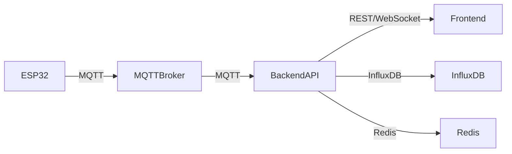

# 🌦️ Weather Station Backend API

## 📖 Descripción General

API backend **robusta y moderna** para el sistema de estación meteorológica IoT. Construida con **Node.js/Express**, integra MQTT para comunicación con dispositivos ESP32, InfluxDB para almacenamiento de series temporales y expone endpoints REST documentados, autenticados y monitoreados en tiempo real.

---

## ✨ Características Destacadas

- 🚀 **API REST** con Express.js 4.18.2
- 📡 **Integración MQTT** para datos en tiempo real
- 📊 **InfluxDB** para almacenamiento eficiente de series temporales
- 🔐 **Autenticación JWT** y gestión de usuarios
- ⚡ **Cache Redis** para alto rendimiento
- 🌐 **WebSocket** (Socket.IO) para actualizaciones instantáneas
- 📚 **Documentación Swagger/OpenAPI** autogenerada
- 🛡️ **Middleware de seguridad** (Helmet, CORS, Rate Limiting)
- 📝 **Logging avanzado** con Winston
- 🚨 **Alertas inteligentes** con umbrales configurables
- 🔍 **Monitoreo y métricas de salud**
- 🧪 **Testing automatizado** (Jest, Supertest)

---

## 🛠️ Tecnologías y Dependencias

### Principales
- **Express.js** – Framework web
- **MQTT** – Comunicación IoT
- **InfluxDB Client** – Base de datos de series temporales
- **Socket.IO** – WebSocket en tiempo real
- **Redis** – Cache y sesiones
- **Winston** – Logging
- **Joi** – Validación de datos

### Seguridad
- **Helmet** – Headers de seguridad
- **bcryptjs** – Hash de contraseñas
- **jsonwebtoken** – Tokens JWT
- **rate-limiter-flexible** – Limitación de requests

### Documentación y Testing
- **Swagger-jsdoc** y **swagger-ui-express**
- **Jest** y **Supertest**

---

## 🚀 Instalación Rápida

### 1️⃣ Requisitos Previos
- Node.js 16+ y npm
- Docker y Docker Compose
- Git

### 2️⃣ Instalación
```bash
# Clona el repositorio
git clone <repo-url>
cd backend

# Instala dependencias
npm install

# Copia y edita variables de entorno
cp .env.example .env
```

### 3️⃣ Configuración de Entorno
```env
# ...variables de entorno principales...
```

### 4️⃣ Levanta los servicios con Docker
```bash
docker-compose up -d
```

---

## 🏃‍♂️ Comandos Útiles

- 🛠️ **Desarrollo:** `npm run dev`
- 🚀 **Producción:** `npm start`
- 🧪 **Testing:** `npm test`
- 👀 **Cobertura:** `npm run test:coverage`
- 🔄 **Tests CI/CD:** `npm run test:ci`

---

## 🏗️ Arquitectura Visual



- **ESP32**: Dispositivos sensores
- **MQTT Broker**: Puente de mensajes
- **Backend API**: Procesamiento, reglas, almacenamiento
- **InfluxDB**: Datos históricos
- **Redis**: Cache y sesiones
- **Frontend**: Visualización y monitoreo

---

## 🛣️ Endpoints Principales

### 🌡️ Weather Data
- `GET /api/weather/data/:stationId/latest` – Última lectura
- `GET /api/weather/data/:stationId?timeRange=30m` – Históricos
- `GET /api/weather/data/:stationId/summary` – Estadísticas
- `GET /api/weather/stations` – Listado de estaciones
- `POST /api/weather/data` – Recibir datos
- `GET /api/weather/export/:stationId` – Exportar CSV/JSON

### 🚨 Alerts
- `GET /api/alerts/:stationId` – Alertas por estación
- `POST /api/alerts` – Nueva alerta
- `PUT /api/alerts/:alertId/acknowledge` – Reconocer alerta

### 🔐 Auth
- `POST /api/auth/login` – Login
- `POST /api/auth/register` – Registro
- `POST /api/auth/refresh` – Renovar token

### 📊 Monitoring
- `GET /api/monitoring/health` – Estado del sistema
- `GET /api/monitoring/metrics` – Métricas

### 🏥 Health Check
- `GET /health` – Verificación completa

---

## 📚 Documentación Interactiva

- 🌐 **Swagger UI:** [http://localhost:5002/api-docs](http://localhost:5002/api-docs)
- 📄 **Spec JSON:** [http://localhost:5002/api-docs.json](http://localhost:5002/api-docs.json)

> Documentación generada automáticamente desde comentarios JSDoc.

---

## 🚨 Sistema de Alertas Inteligente

- 🔔 **Reglas configurables** por parámetro y severidad
- 🟢 LOW | 🟡 MEDIUM | 🔴 HIGH | 🚨 CRITICAL
- 💬 Notificaciones en tiempo real vía WebSocket

---

## 🗄️ Esquema de Base de Datos

- **InfluxDB**: 
  - Medición: `weather`
  - Tags: `station_id`
  - Campos: `temperature`, `humidity`, `pressure`, etc.
- **Alertas**:
  - Medición: `alerts`
  - Tags: `station_id`, `severity`
  - Campos: `parameter`, `value`, `threshold`, `message`, `acknowledged`

---

## 🧪 Testing y Calidad

- Estructura modular en `/tests`
- Cobertura y reporte con Jest
- Pruebas unitarias e integración

---

## 🔍 Monitoreo y Observabilidad

- **Health Check**: Estado general y dependencias
- **Métricas**: Uptime, memoria, conexiones, latencia, errores
- **Logs**: Winston multi-transporte (archivo y consola)

---

## 🔄 Integración MQTT

- **Entrada**: `weather/data/{stationId}`
- **Estado**: `weather/status/{stationId}`
- **Comandos**: `weather/command/{stationId}`
- **Alertas**: `weather/alerts/{stationId}`

---

## 🌐 WebSocket Events

- `weather_update` – Nueva lectura
- `alert_created` – Nueva alerta
- `station_status` – Estado de estación
- `system_health` – Salud del sistema

---

## 🚀 Despliegue Seguro

- Variables críticas: `NODE_ENV`, `JWT_SECRET`, `INFLUXDB_TOKEN`
- HTTPS recomendado en producción
- Firewall y backup activos
- Logging reducido (`LOG_LEVEL=warn`)

---

## 🐛 Solución de Problemas

- **MQTT**: Verifica broker y configuración
- **InfluxDB**: Chequea servicio y variables
- **Redis**: Prueba conexión y limpia cache
- **Logs**: `logs/combined.log` y `logs/error.log`

---

## 📈 Mejoras Futuras

- 🔒 Rate limiting avanzado
- 📧 Notificaciones email/SMS
- 🔍 Métricas Prometheus
- 🎯 Machine Learning para predicción
- 🌍 Multi-tenancy
- 📱 API GraphQL

---

## 🤝 Contribuye

1. Haz fork del repo
2. Crea tu branch (`feature/LoQueSea`)
3. Haz commit y push
4. Abre un Pull Request

---

## 📞 Soporte

- Documentación: `CLAUDE.md`
- API Docs: [http://localhost:5002/api-docs](http://localhost:5002/api-docs)
- Health: [http://localhost:5002/health](http://localhost:5002/health)

---

**⚡ Backend listo para producción y crecimiento ⚡**